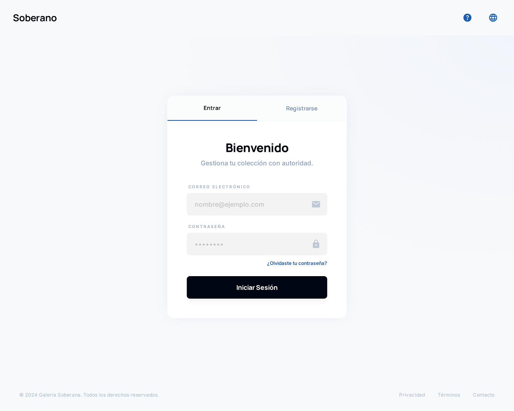
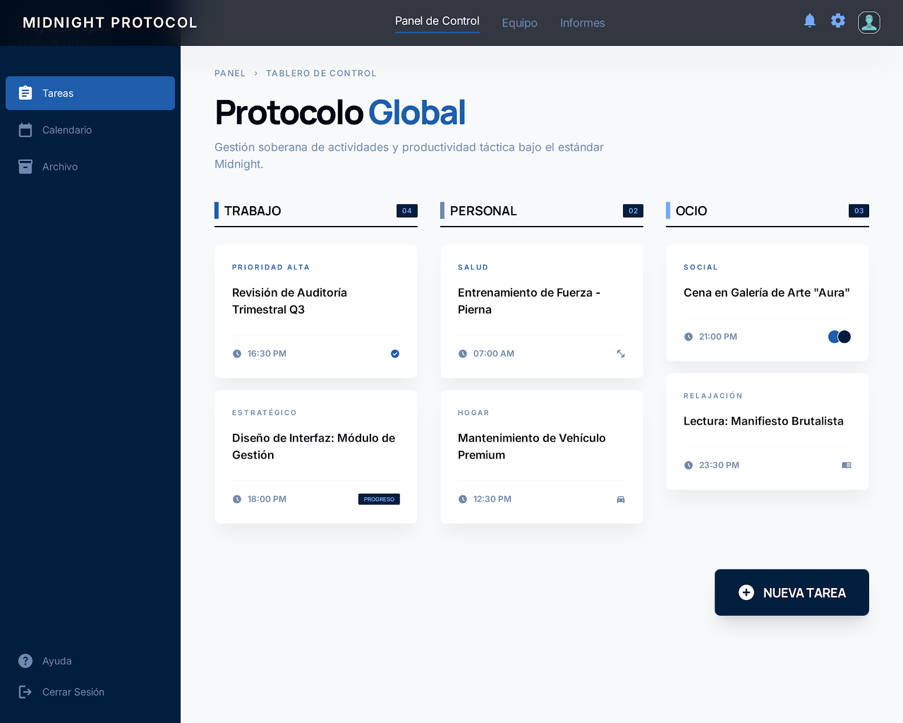
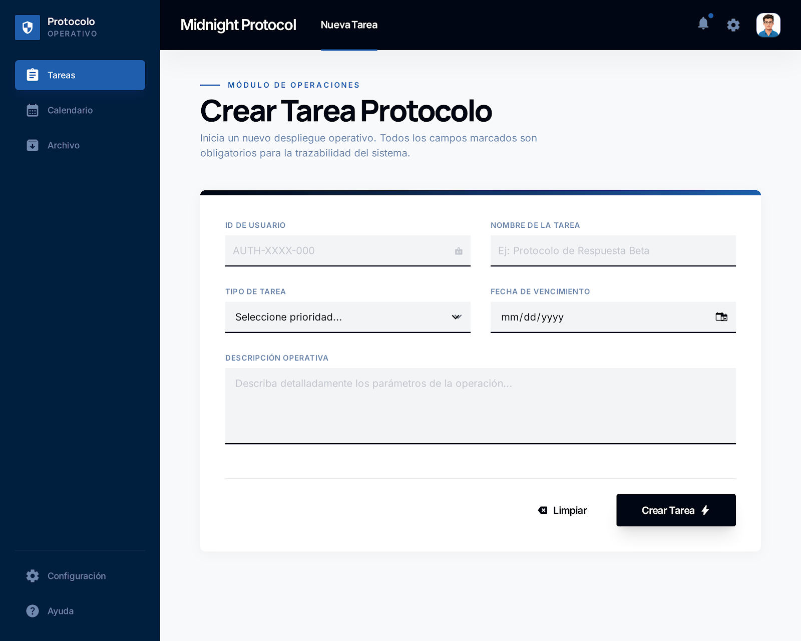
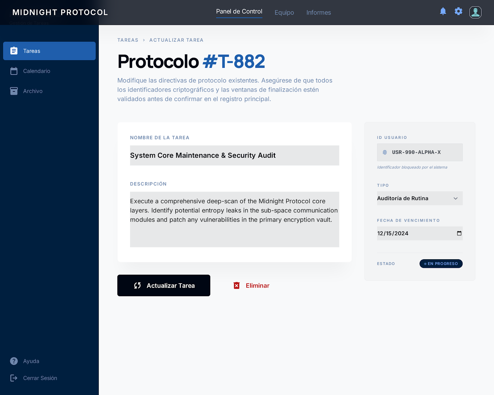

# Gestor de Tareas con Drag & Drop

Aplicación web para organizar tareas en columnas estilo Kanban.

## Tecnologías
- Frontend: React + TypeScript + Tailwind CSS
- Backend: Next.js API Routes
- Base de datos: Postgres (Supabase)
- Despliegue: Vercel
- Propuesta: Pantallas (Stitch)

## Funcionalidades
### 1. Version 1 
- Crear, editar y eliminar tareas
- Autenticación y creacion de usuarios
- Persistencia en base de datos

## Estructura 
```
Desarrollo-Equipo1/
├── README.md
├── schema.sql                        ← Script de creación de BD (Postgres)
├── .env                              ← Plantilla de variables de entorno
├── package.json
├── next.config.ts
├── propuesta/                        ← Imágenes exportadas de Stitch
├── README.md                         ← Pantallas y modelo de BD explicados
├── app/
│   ├── layout.tsx                    ← Layout raíz
│   ├── page.tsx                      ← Login / Registro (/)
│   └── api/
│       ├─ auth/
│       |   ├── register/route.ts     ← POST /api/auth/register
│       |   └── login/route.ts        ← GET  /api/auth/login
│       ├─ usuarios/
│       |  └── id/
|       |       ├── update/route.ts  ← PUT /api/usuarios/id
|       |       └── delete/route.ts  ← DELETE /api/usuarios/id
│       └── tareas/
|           ├── register/route.ts    ← POST /api/tareas/register
|           ├── list/route.ts        ← GET /api/tareas/list
│           └── id/
|               ├── update/route.ts  ← PUT /api/tareas/id
|               ├── delete/route.ts  ← DELETE /api/tareas/id
|               └── route.ts         ← GET /api/tareas/id
├── lib/
|   ├── supabaseClient.ts             ← Cliente Supabase inicializado
│   └── auth.ts                       ← Helpers JWT
├── models/
│   ├── user.model.ts                 ← Queries de usuarios
│   └── task.model.ts                 ← Queries de tareas
├── proxy.ts                          ← Verificación JWT (Next.js proxy)
└── public/                           ← Assets estáticos
```
## Diseño de la app web
#### Login | Registro

#### Tablero

#### Interfaz de crear tarea

#### Interfaz de actualizar tarea


Se tomara mas en cuanta el diseño de el tablero par el desarrollo de la interfaz


### Posible escalamiento con conexion a calendario personal

*Proyecto · Desarrollo Web 2026 LGSC*
